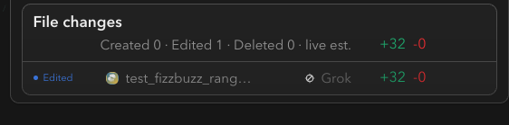

# How to: File changes row

**Platform:** Electron

## What it is
The file changes row is the "File changes" card that summarizes every file an agent created, edited, or deleted in the current chat — created/edited/deleted counts, total added/deleted lines, and a list of changed-file rows you can preview or open as a full diff.

## Where to find it
It sits at the bottom of the transcript, just above the composer, in any workspace chat that has file changes (it's hidden in a General/Global chat unless that chat has changes too).

## How to use it
1. Check the header for a quick summary: counts of created/edited/deleted files and a `+added | -deleted` line total.
2. Hover (or Tab-focus) a changed-file row to open the diff hover preview without leaving the transcript.
3. Click a changed-file row, or its "Diff" bubble, to open that file's diff in the Workbench popout window.
4. Click "Show N more files" if the list is collapsed, or "Show fewer files" to collapse it again.
5. If a run touched an unusually large number of files, a final line reports how many are omitted from the summary.

## Tips & related
- [Diff hover preview](diff-hover-preview.md) — the popover shown when you hover or focus a row here.
- [Activity stack](activity-stack.md) — the collapsible tool-call rows where individual edits also happen during a turn.
- [Transcript message stream](transcript-message-stream.md) — the surrounding scroll this card renders at the bottom of.
