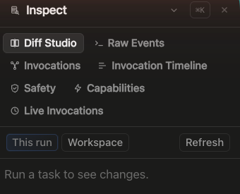

# How to: Inspector panel

**Platform:** Electron

## What it is
The Inspector is the right-dock panel for digging into a chat's run details: file diffs, your unpushed commit stack, raw streamed events, the composed prompt, sub-agent invocations, a timeline view, safety/approval state, provider capabilities, and live background invocations.

## Where to find it
Click **Inspect** in the right-dock rim (the icon strip at the edge of the chat) to open it. Inside the panel, nine icon tabs switch between views: **Diff Studio**, **Commits**, **Raw Events**, **Prompt**, **Invocations**, **Invocation Timeline**, **Safety**, **Capabilities**, and **Live Invocations**.

## How to use it
1. Open **Diff Studio** to review file changes for the current run or the whole workspace; if a run touched multiple write-enabled workspaces, a selector lets you switch between them.
2. Open **Commits** to browse the workspace's unpushed commit stack with per-commit attribution, group selected commits into a pull request, and manage that PR — open, update, and track it — through an audited GitHub lifecycle.
3. Open **Raw Events** to see the live, filterable stream of stdout/stderr/tool events as the agent runs — filter by `stdout`, `stderr`, or `tool`.
4. Open **Prompt** to inspect what the run was actually sent: a Layers view of the composed prompt envelope with per-layer digests, and a Wire view of the exact text dispatched at the transport's launch boundary.
5. Open **Invocations** to see a delegation audit of sub-agent/tool activity for the run, with per-provider chips.
6. Open **Invocation Timeline** to see delegated chats (sub-threads) under the current chat laid out as a tree with elapsed time per node.
7. Open **Safety** to check the active provider's sandbox, approval policy, auth state, plan/usage info, and external path grants.
8. Open **Capabilities** to inspect the provider's available MCP servers, extensions, skills, and agents.
9. Open **Live Invocations** to see currently running or queued child-agent threads for the chat; click a row to jump to that agent's card in the transcript.

## Tips & related
- [Activity stack](activity-stack.md) — the inline, collapsible tool-call rows in the transcript that the Raw Events and Invocations tabs expand on.
- [Diff hover preview](diff-hover-preview.md) — a quick popover preview of a diff; use Diff Studio here when you need the full view.
- [Sub-Thread Delegation](../chats-and-threads/sub-thread-delegation.md) — the feature behind the Invocation Timeline's delegation tree.
