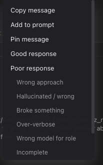

# How to: Message context menu

**Platform:** Electron

## What it is
A right-click menu on a transcript message that lets you copy its text or your current selection, push it into the composer, pin or unpin it, rate an assistant reply, spin it off into a new side chat, or delete it from the transcript.

## Where to find it
Right-click any message bubble in the main transcript: user messages, assistant/system/guest-participant replies, tool messages, provider-failure cards, and sub-thread result cards. The menu opens at the cursor position, and read-only items like provider-failure cards get a copy-only menu.

## How to use it
1. Right-click a message bubble to open the menu.
2. Choose **Copy message** to copy its text to the clipboard (disabled if there's nothing to copy).
3. Choose **Copy selection** to copy only the text you had highlighted (disabled when nothing is selected).
4. Choose **Add to prompt** to drop the message's text into the composer for your next turn.
5. Choose **Pin message** / **Unpin message** to toggle the message's pinned state.
6. On an assistant reply, choose **Good response** or **Poor response** to rate it; picking either again offers **Remove good rating** / **Remove poor rating**. Beneath them, an indented reason list (Wrong approach, Hallucinated / wrong, Broke something, Over-verbose, Wrong model for role, Incomplete) records a specific "poor" reason in one click. Ratings are not offered on your own messages or on inbound channel messages.
7. Choose **Open side chat** to start a new isolated side chat seeded with that message's content (not available on linked/child chats).
8. Choose **Delete message** to permanently remove it from the transcript; you'll get a confirmation prompt first, and deletion is blocked while the message has an open prompt (agent question or plan choice) waiting on it.
9. Use Arrow Up/Down, Home/End, or Escape to navigate or dismiss the menu with the keyboard.

On read-only items the menu is copy-only: everything below **Copy selection** — Add to prompt, Pin, ratings, Open side chat, and Delete — is suppressed.

## Tips & related
- [Pinned Messages](../chats-and-threads/pinned-messages.md) — review everything you've pinned across chats.
- [Side Chat](../chats-and-threads/side-chat.md) — more on the isolated chat that "Open side chat" creates.
- [Copy transcript button](copy-transcript-button.md) — copy the whole transcript instead of one message.
- [Transcript message stream](transcript-message-stream.md) — the message list this menu attaches to.
