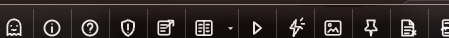

# How to: Right dock rim

**Platform:** Electron

## What it is
The right dock rim is the icon strip at the top of the right dock — the resizable panel docked to the right edge of the chat. It lets you switch between **Home**, **Chat**, **Media**, **Notes**, **Files**, **Inspect**, and the optional workspace **Term** surface without leaving the transcript.

## Where to find it
It appears at the top of the right dock whenever the dock is open. The dock opens automatically when you open one of its panels (for example, clicking **Inspect**). Context-dependent tabs are disabled when their required chat, side chat, or workspace is unavailable.

## How to use it
1. Click a rim icon to switch the dock to that panel: **Home** (sidebar destinations), **Chat** (an open side chat), **Media** (this chat's media), **Notes** (Blackboard, notes, and pins), **Files** (the file editor), **Inspect** (diffs, commits, raw events, and the composed prompt), or **Term** when a workspace terminal is available.
2. Switching tabs is exclusive — opening one panel closes whichever panel was open before, so only one shows at a time.
3. Disabled icons show why they're unavailable: **Chat** needs a side chat opened from a message first, **Files** needs a workspace bound to the chat, and **Notes** needs a chat open.
4. A badge on **Media** or **Notes** shows the current count of media items or pinned messages.
5. TaskWraith remembers the last-selected destination for the current app session. Chat and Code remember per chat; Work remembers per project when the focused chat belongs to exactly one project, otherwise it falls back to that chat's memory.
6. Click the **X** at the end of the rim to close the active panel (or hide the side chat if **Chat** is active).

## Tips & related
- [Inspector panel](inspector-panel.md) — opened from the **Inspect** tab; has its own set of sub-tabs.
- [File changes row](file-changes-row.md) — file diffs you can also review via the **Files** tab.
