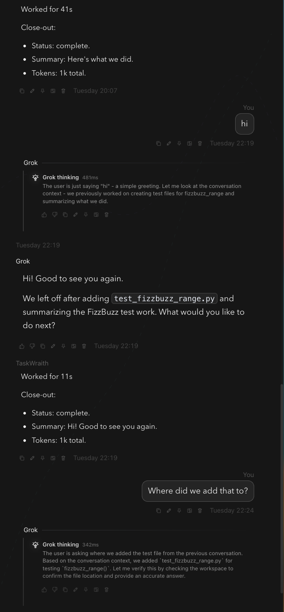

# How to: Transcript message stream

**Platform:** Electron

## What it is
The main scrolling chat view showing all messages, assistant replies, tool activity, and inline cards in order.

## Where to find it
In the center stage whenever a chat is open.

## How to use it
1. Scroll to read history. The view auto-follows new messages at the bottom.
2. When new messages arrive while you are scrolled up, a **"↓ N new messages"** pill appears — click it or press **End** to jump to the latest message.
3. Right-click a message to copy, pin, unpin, delete, or open it in a side chat.
4. Hover a message footer for its timestamp and quick actions.
5. Long pasted messages collapse automatically — click **Show more** / **Show less** to expand or collapse them.
6. Tool activity appears inline beneath an agent's turn, grouped into expandable stacks.

## Tips & related
- [Message context menu](message-context-menu.md) — right-click options for any message
- [Copy transcript button](copy-transcript-button.md) — copy the entire transcript
- [Activity stack](activity-stack.md) — collapsible tool-call list in the stream
- [Pinned messages](../chats-and-threads/pinned-messages.md) — review pinned messages from this stream
