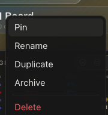

# How to: Board Overflow Actions

**Platform:** Electron

## What it is
Board overflow actions are the per-board options — Pin/Unpin, Rename, Duplicate, Archive, and Delete — available on each workspace board's row in the sidebar.

## Where to find it
In the sidebar's **Workspace Boards** section, hover a board row and click its **⋯** button, or right-click the row directly.

## How to use it
1. Open the sidebar's **Workspace Boards** section and locate the board.
2. Click the **⋯** trigger on the board's row (or right-click the row) to open its actions menu.
3. Choose **Pin** (or **Unpin** if already pinned) to keep the board near the top of the list.
4. Choose **Rename** to edit the board's name.
5. Choose **Duplicate** to create a copy of the board.
6. Choose **Archive** to move the board out of the active list.
7. Choose **Delete** to remove the board permanently — this action is separated from the others and marked as destructive.

To add a chat or workflow to a board instead, use that chat's or workflow's own overflow menu and pick **Add to Workspace Board**.

## Tips & related
- [Workspace Boards](workspace-boards.md) — the kanban board view these actions manage.
- [Workflows Sidebar Section](workflows-sidebar-section.md) — the sidebar section workflows live in before being added to a board.
