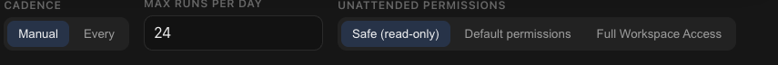

# How to: Workflow Compose Controls

**Platform:** Electron

## What it is
The Workflow Compose Controls are the settings row under the composer when you're drafting a new workflow: cadence (manual or interval), max runs per day, and the unattended permission level the workflow runs with. Ensemble On/Off is the composer's separate, general **Ensemble** control.

## Where to find it
Select **Code**, open the **Workflows** section in the sidebar, and click the **+** (New workflow) button. This opens a fresh chat in workflow-compose mode, with the workflow hero above and the controls below the composer.

## How to use it
1. Choose a **cadence**: **Manual** (the workflow only runs when you trigger it) or **Every** (runs on a fixed interval).
2. If you chose **Every**, set the interval in **Minutes**.
3. Set **Max runs per day** to cap how often the workflow can fire.
4. Separately, use the composer's **Ensemble** control and choose **On** to make this a multi-agent workflow instead of a single-provider one — this swaps the draft to an Ensemble chat and carries over any prompt you've already typed.
5. Pick the **Unattended permissions** level the workflow is allowed to use when it runs without you watching: **Safe (read-only)**, **Default permissions**, or **Full Access**.
6. Type your prompt in the composer and send it — the first send saves these settings as the workflow's definition and turns this chat into the workflow's thread.

## Tips & related
- [Workflow Creator](workflow-creator.md) — the complete first-send creation flow that hosts these inline controls.
- [Workflows Sidebar Section](workflows-sidebar-section.md) — manage, run, and edit workflows after they're created.
- [Permission Elevation Sheet](../approvals-and-permissions/permission-elevation-sheet.md) — more on unattended elevation levels and how they cap permissions.
- [Ensemble Mode Picker](../composer/ensemble-mode-picker.md) — the separate composer control used to switch Ensemble On or Off.
