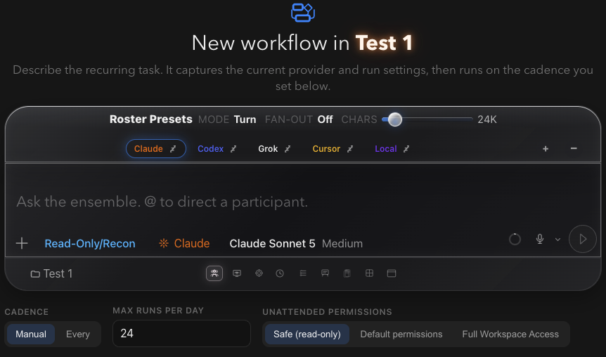

# How to: Workflow Creator

**Platform:** Electron

## What it is
The workflow creator turns a normal chat into a repeatable run template. It opens a fresh chat with a workflow-specific welcome hero, the composer's normal **Ensemble** On/Off control, and a separate workflow settings row for cadence, interval, daily run limit, and unattended permission level; sending your first message saves it as a `WorkflowDefinition` and the chat becomes that workflow's thread.

## Where to find it
Select **Code**, then click the **+** ("New workflow") button in the sidebar's **Workflows** section. It's disabled until you have at least one workspace, since workflows always run inside a workspace.

## How to use it
1. Select **Code**, then click **+** next to **Workflows** in the sidebar. This opens a new chat in compose mode with the workflow controls under the composer.
2. If Ensemble mode is enabled in Settings, set **Ensemble** to **On** or **Off** before saving. Switching modes converts the same idle draft and keeps any prompt you've already typed.
3. Set **Cadence** to **Manual** (run it yourself) or **Every** with a number of minutes for recurring runs.
4. Set **Max runs per day** to cap how often the workflow can fire.
5. Choose **Unattended permissions** — Safe (read-only), Default permissions, or Full Access — for runs that happen without you present.
6. Type the prompt the agent should run each time, then send it. This save acts as creation: the prompt and settings become a saved workflow, and no run is dispatched from this first send.

## Tips & related
- [Workflows Sidebar Section](workflows-sidebar-section.md) — manage, enable/disable, and view history for workflows you've created.
- [Workflow Compose Controls](workflow-compose-controls.md) — details on the cadence/interval/permission controls shown during creation.
- [Permission Elevation Sheet](../approvals-and-permissions/permission-elevation-sheet.md) — confirms non-safe unattended permission levels after the workflow is saved.
