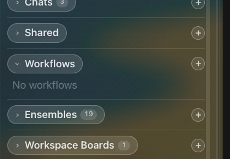

# How to: Workflows Sidebar Section

**Platform:** Electron

## What it is
The Workflows section lists your automated workflows — chats that run on a schedule (manual, one-time, interval, or cron) instead of a single one-off prompt. Each entry shows its name, trigger cadence, and current status, and expands into controls for running, pausing, editing, and deleting it.

## Where to find it
In the sidebar's hierarchy list, below Active Runs and Local Servers, and above Workspace Boards. Click the header to collapse or expand the section, or click a workflow to open its chat and expand its detail panel.

## How to use it
1. Click the **+** button beside the **Workflows** header to start a new workflow (requires at least one workspace — workflows run inside a workspace).
2. Click a workflow row to open its chat in the main pane and expand its detail panel, showing next run time, last run status, and recent run history.
3. In the expanded detail panel, use the icon strip to **Run now**, add the workflow to a **Workspace Board**, **Pause/Resume** it, edit its **cadence**, or grant/revoke **unattended permissions**.
4. While a workflow is actively running, a **Cancel** action appears in the icon strip.
5. Click **Delete** to remove a workflow.
6. Each workflow row shows its current status (e.g. paused, queued, running) and, for loop-based workflows, the iteration count from its last run.

## Tips & related
- [Workflow Creator](workflow-creator.md) — the modal/flow used to create a new workflow.
- [Workflow Compose Controls](workflow-compose-controls.md) — the cadence, interval, and unattended-level controls shown when composing a workflow.
- [Workspace Boards](workspace-boards.md) — drag or add a workflow card onto a board to track it alongside chats.
- [Add workspace](../getting-started/add-workspace.md) — workflows are workspace-scoped, so you need a workspace before creating one.
