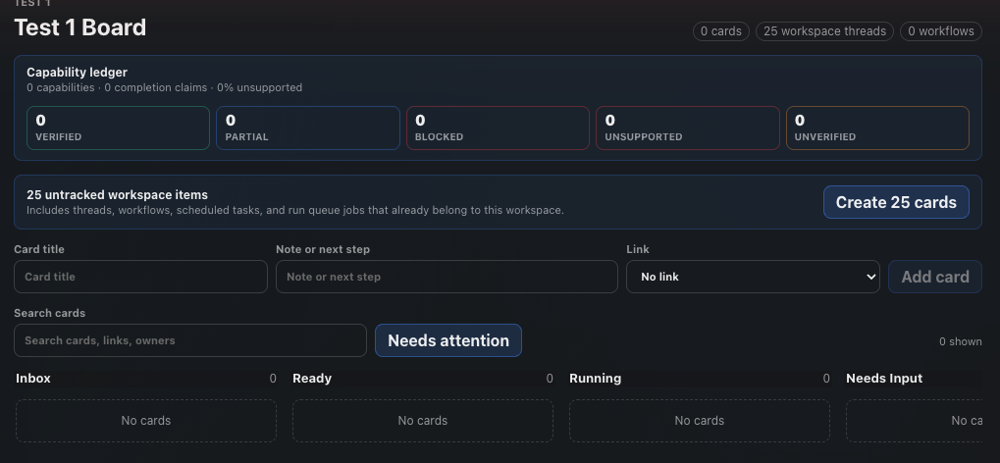

# How to: Workspace Boards

**Platform:** Electron

## What it is
A Workspace Board is a kanban-style view scoped to one workspace, with columns like Inbox, Ready, Running, Needs Input, Blocked, Review Ready, and Done. Cards can stand alone or link to a chat, workflow, scheduled task, run-queue job, or local server, and linked cards automatically inherit a live status (running, needs input, blocked, review-ready, done, or stale) from whatever they're linked to.

## Where to find it
Select **Code**, then open the sidebar's **Workspace Boards** section. Click a board to open it in the center stage; create a new one from the sidebar's "+" / New menu (**New Workspace Board**), which requires at least one workspace to exist.

## How to use it
1. Select **Code**, then open a board from the **Workspace Boards** section in the sidebar.
2. If the board shows "N untracked workspace items," click **Create N cards** to seed it with cards for the workspace's existing threads, workflows, scheduled tasks, run-queue jobs, and local servers.
3. Add a card manually with the **Add board card** form (title, optional note, optional link to a chat/workflow/task/job/server); new cards land in the Inbox column.
4. Move a card by dragging it to another column, using its column dropdown, or the **Up**/**Down** buttons to reorder within a column.
5. Click **Details** on a card to edit its title, body, owner, labels, blocked reason, next step, or reminder, or to unlink it.
6. Click **Open** on a linked card to jump to its chat, workflow, or local server.
7. Use **Search cards** or the **Needs attention** toggle to filter the board to cards in running, needs-input, blocked, review-ready, or stale states.
8. Click **Archive** to move a card out of the active board (use **Undo archive** to bring back the most recently archived card), or delete a card permanently from its Details panel.

## Tips & related
- [Workflows Sidebar Section](workflows-sidebar-section.md) — manage the automated workflows that board cards can link to.
- [Board Overflow Actions](board-overflow-actions.md) — pin, rename, duplicate, or archive a board itself from the sidebar.
- [Workflow Creator](workflow-creator.md) — create the workflows you can seed onto a board.
