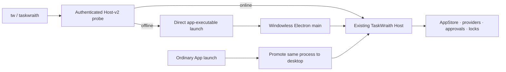

# TUI Windowless Host Closeout

> **SUPERSEDED (2026-08-25).** This file is historical. It describes the
> predecessor path in which the TUI launched the TaskWraith **app
> executable** with `--taskwraith-headless-host` so Electron main ran
> windowless.
>
> **Current TUI Host:** a pure-Node `taskwraith-host` process. The launch
> resolver spawns ordinary Node only —
> [`hostProcessManager.ts`](./hostProcessManager.ts) builds
> `[cli, 'serve', '--mode', 'production', '--profile', p]`, refuses any
> executable that is not ordinary Node, and strips `ELECTRON_RUN_AS_NODE`.
> `tw` auto-starts that Host when none is reachable; `tw --no-start-host`
> is connect-only. Standalone production composes the nine live-selectable
> providers; AntiGravity stays desktop-conditional and is not composed;
> Cursor is setup/auth-only (run hard-stop); Grok advertises `grok login` plus
> env keys; Pi is env-only with no begin-able login. Operator contract:
> [`README.md`](./README.md) Current boundary,
> [`HostStandaloneProviderMatrix.ts`](../host-shared/HostStandaloneProviderMatrix.ts),
> and [`DESIGN.md`](./DESIGN.md). Arc status:
> [`docs/host-arc/HOST_ARC_STATUS.md`](../../docs/host-arc/HOST_ARC_STATUS.md).
>
> App-side posture handling still exists
> ([`TuiHeadlessHostSession`](../main/TuiHeadlessHostSession.ts), wired
> from `src/main/index.ts`), but nothing in the TUI passes the headless
> flag any more; the argv constant is the surviving reference. The
> “Pure-Node follow-up” section at the bottom is what README/DESIGN now
> describe as done for the TUI launch path. Desktop cutover remains a
> separate, gated concern.
>
> The historical body is retained below. Do not treat its acceptance
> contract (packaged App launch, windowless Electron main) as current TUI
> smoke requirements.

**Status:** Superseded — historical closeout 2026-08-16

**Closed:** 2026-08-16

**Boundary (historical):** GUI-independent TUI backed by a supervised Electron Host

## Outcome

`taskwraith` / `tw` no longer requires the desktop window to be open first. The
TUI performs an authenticated Host-v2 probe and reuses the existing Host when
available. When the normal release or built development Host is offline, it
directly launches the TaskWraith app executable with an exact headless flag and
the TUI process identity, waits for an authenticated handshake, then connects.

This closes independence from the GUI. It does **not** claim a pure-Node Host:
AppStore, providers, approval authority, credentials, workspace locks, and run
dispatch remain composed in Electron main.

## Lifecycle contract

- An exact `--taskwraith-headless-host` plus one positive
  `--taskwraith-headless-parent=<pid>` selects windowless posture. Malformed
  intent fails closed.
- macOS presentation and initial `BrowserWindow` creation are suppressed.
- A duplicate headless launch never surfaces a window. An ordinary App launch
  promotes the existing process and preserves the one persistence/provider
  authority.
- After the launching TUI exits, the Host remains alive while another local
  client is connected, accepted provider dispatch is still entering
  `RunManager`, or provider work is active. It quits only after the parent-loss
  grace, every occupancy check reaches zero, and a final cancellable quiescence
  recheck gives an ordinary desktop launch priority over shutdown.
- There is no installed daemon, login item, silent crash-restart loop, or token
  on argv. `ELECTRON_RUN_AS_NODE` is stripped from child launch environment.

## Authority and profile safety

- Readiness means a successful authenticated Host-v2 handshake, never merely a
  discovery file or live PID.
- Concurrent starts are serialized in-process; cross-process races converge
  through Electron's existing single-instance lock.
- Existing Hosts are reused. Discovery PIDs are never killed or treated as
  authority. The TUI only observes the child handle it created.
- Release and development profiles are derived by the same existing app
  posture (`TASKWRAITH_INSTANCE_ID` included for development). An explicit
  `--user-data` / `TASKWRAITH_USER_DATA` profile is connect-only: the TUI will
  not guess private-profile launch authority.
- Owner-only discovery/token permissions, canonical Host command validation,
  signed effective permissions, provider admission, workspace locks, and
  durable receipt semantics are unchanged.

## Independent attention handling

The TUI no longer needs a desktop window for projected selected-thread asks:

- `y` / `n` accepts or declines the oldest pending approval by exact
  `approvalId` when the composer is empty;
- composer `Enter` answers the oldest open question by exact `questionId`;
- `/dismiss` explicitly dismisses that question;
- answers retain the Host protocol's 8,000-character ceiling; and
- a run that reports “needs input” without a projected identity still falls
  back to “Open TaskWraith to answer” rather than inventing authority.

## Acceptance contract

Every closeout/release build must retain:

1. focused lifecycle, main-wiring, launcher-race, profile, approval, and question
   tests;
2. the full `src/tui` suite and TUI TypeScript build;
3. a disposable packaged external-process smoke that starts offline, invokes
   packaged `tw --snapshot` without a connect-only bypass, resolves and launches
   the packaged App itself, verifies its windowless command posture and
   owner-only Host-v2 discovery/token, authenticates, then proves the Host exits
   after the TUI disconnects; and
4. a normal-launch promotion check plus stale/incompatible Host refusal.

The source commits that established this boundary are `cffd69560`,
`372b1bd54`, `da111fb4c`, and `525f2f193`.

## Pure-Node follow-up

A truly Electron-free Host remains a separate architecture arc: inject the
AppStore runtime/platform, establish cross-process single-writer fencing,
extract provider launch/event sinks, move approval registries and timeout
recovery into Host-owned services, then cut Desktop over as a Host client. Do
not describe the current windowless companion as that completed migration.
